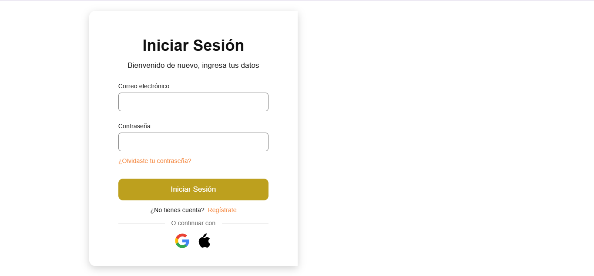

# 🔑 Sistema de Login (Inicio de Sesión)

Este es un proyecto personal de una interfaz de inicio de sesión sencilla.
## 🛠️ Tecnologías utilizadas

* **HTML5:** Estructura del formulario y elementos de entrada.
* **CSS3:** Diseño visual, estilos personalizados y adaptabilidad (responsive design).
* **JavaScript:** Validación de campos vacíos e interactividad del formulario.
## 📂 Cómo usar este código

Si deseas probarlo localmente desde otra cuenta, puedes clonar este repositorio o descargar el archivo ZIP:

```bash
git clone [https://github.com/TU_USUARIO/TU_REPOSITORIO.git](https://github.com/TU_USUARIO/TU_REPOSITORIO.git)


